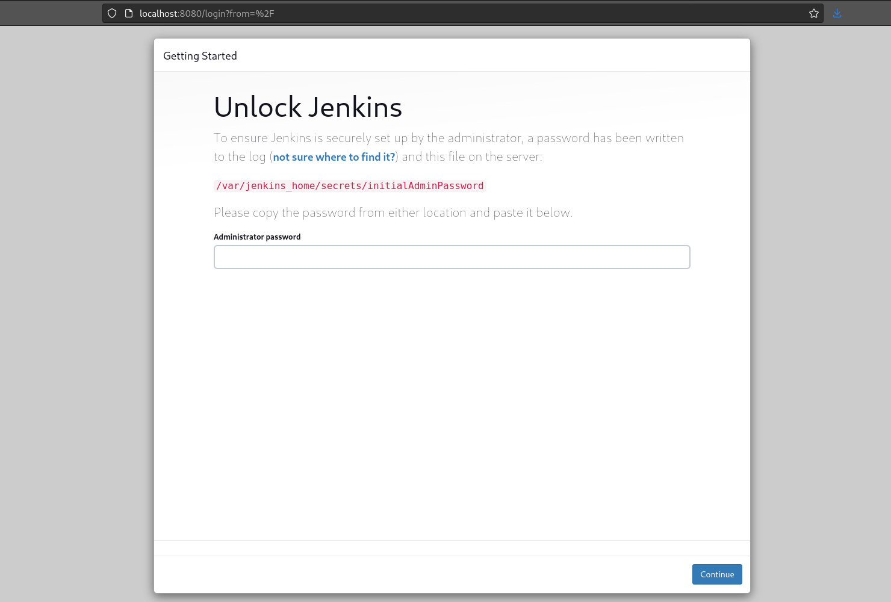

# ☀️ Jun 2, 2023
Tech : Django, Basics of CI/CD, Jenkins

# Django
## Template Inheritance 

In a WebApp, Generally, we have a lot of HTML content like `<head>` common across all the pages. To Avoid Copy-Pasting, we can use HTML Templates Inheritance.

### Step 1 : Create a Layout 
Create `Layout.html` file in `<APP_NAME>/templates/<PAGE_NAME>` dir

``` HTML
<!DOCTYPE html>
<html lang="en">
<head>
    <title>Todo App</title>
</head>
<body>
    
    
</body>
</html>
```
here,
``` HTML
    
    
```
represents as the position where the block of named `<NAME>` will go.

### Step 2 : Adjust other pages
Remove the HTML defined in the `Layout.html` file from all the pages of your WebApp & just keep the necessary bits of code enclose within a block

**PAGE1.html**
``` HTML



    <h3> This is Page 1</h3>

```

**PAGE2.html**
``` HTML



    <h3> This is Page 2</h3>
    <p>
        Lorem ipsum dolor sit amet, consectetur adipiscing elit, sed do.
    </p>

```

here,
- `` line links the html page to its layout.html

## Connecting Pages 
Although we can Copy-Page links into the Pages to connect them, but, Theirs a better way........

`urls.py` file of this WebApp
``` Python
from django.urls import path
from . import views

urlpatterns = [
    path("", views.page1, name="Page1"),
    path("page2", views.page2, name="Page2")
]
```

`views.py` file of this WebApp
``` Python
from django.shortcuts import render

# Create your views here.

def page1(request):
    return render(request, "<PAGE_NAME>/PAGE1.html")
    
def page2(request):
    return render(request, "<PAGE_NAME>/PAGE2.html")
```

Now, We can Add links to the HTML pages

### Step 1 : Defining `app_name` in `urls.py`

We need to define a variable `app_name = "<APP_NAME>"` inside `urls.py file` to avoid namespace conflicts.

``` Python
from django.urls import path
from . import views

app_name = "<APP_NAME>"

urlpatterns = [
    path("", views.page1, name="Page1"),
    path("page2", views.page2, name="Page2")
]
```

### Step 2 : Add Links to the HTML Pages

**PAGE1.html**
``` HTML



    <h3> This is Page 1</h3>

    <a href="">Go to Page 2</a>

```

**PAGE2.html**
``` HTML



    <h3> This is Page 2</h3>
    <p>
        Lorem ipsum dolor sit amet, consectetur adipiscing elit, sed do.
    </p>

    <a href="">Back to Page 1</a>

``` 

# Basics of CI/CD

CI/CD is a way of Taking a Piece of Code, Packaging it, and then, Deploying it to Production machine (it can be VMs, Containers, or some Cloud Sol.)

### Continuous Integration (CI)

CI is a Process in which we take a piece of code and package it. Here's some steps involved :

1. Pulling Code form the Repo.
2. Building/Compiling the Code.
3. Arranging Dependencies.
4. Packaging Binaries & Dependencies.
5. Testing the Applications.
6. Security Checks.

### Continuous Delivery / Continuous Deployment (CD)

CD is a Process of taking the Package from CI process and Placing it onto the Production env.

- **Continuous Deployment** : Requires NO Manual Human Intervention to Take Packaged Application from CI Process and Deploying it to Production Env.

- **Continuous Delivery** : Requires Some Manual Human Intervention (not like SSH into Production Server, Coping the files and then Deploying but like Pressing A Button to Approve.) to Take Packaged Application from CI Process and Deploying it to Production Env.

# Jenkins

## Installing Jenkins (on VMs)

- **Step 1**: Setup a base Ubuntu/CentOS VM

- **Step 2**: Install OpenJDK (version specified by [Jenkins Docs](https://www.jenkins.io/doc/book/installing/))

- **Step 3**: Set Up Jenkins Repo & Install Jenkins with Your Package Manager (more on this : [Jenkins Docs](https://www.jenkins.io/doc/book/installing/))

- **Step 4 (optional)**: Changing Port for Jenkins. in `/lib/systemd/system/jenkins.service` file, edit this entry : 
    ``` bash
    Environment="JENKINS_PORT=8080"
    ```
    Default Port for Jenkins is 8080

- **Step 5**: Open the port 
    ``` bash
    sudo ufw allow 8080
    sudo ufw status
    ```- 
Container

    if is gives some error : 
    ``` bash
    sudo systemctl status jinkins
    ```
    ``` bash
    sudo systemctl daemon-reload
    ```


## There's an easy way : Installing Jenkins (on a Docker Container)

- Pull the image & Run the Container 
    ``` bash
    docker run -t -p 8080:8080 --name JEN jenkins/jenkins
    ```
    here,
    - `--name JEN` is for settings the name of the container as JEN. It's optional.

## Getting Started With Jenkins

**Step 1** : Get the Admin Password for the initial setup.

On the first run you will be prompted following
``` bash
...
*************************************************************
*************************************************************
*************************************************************

Jenkins initial setup is required. An admin user has been created and a password generated.
Please use the following password to proceed to installation:

xxxxxxxxxxxxxxxxxxxxxxxxxxxxxxxx
Container*******
*************************************************************
*************************************************************
...
```

**Step 2** : Go to the URL:PORT of the Jenkins VM/Container. This Window will look like this



**Step 3** : Fill in the Admin Password.

**Step 4** : Install Plugins.

**Step 5** : Setup Admin User & Welcome to Jenkins..