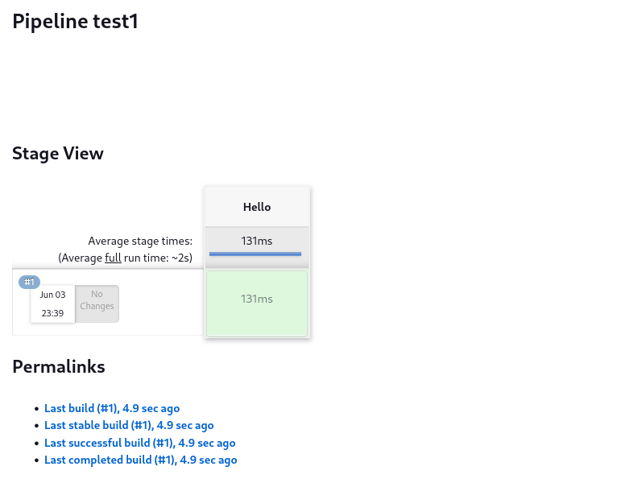

# ☀️ Jun 3, 2023
Tech : JavaScript, Jenkins

# JavaScript
### Link a HTML Page to .JS File 
``` bash
    <head>
        <script src="MyJS.js"></script>
    </head>
```

### Embedding JavaScrip into the HTML file
``` bash
    <script>
        - - - 
    </script>
```

### Alert Box
To Print an Alert Message to user
``` JavaScript
alert("Hello, World!");
```


### Find an Element

Locate the first element with the given class:
``` JavaScript
document.querySelector('.class');
```

Locate the element with the given id:
``` JavaScript
document.querySelector('#id');
```


### To update the inner html of an html
``` JavaScript
document.querySelector().innerHTML = <NewHTML>
```

### Variable Definition in JavaScript
``` JavaScript
let x = 1000;
```

### Function Definition in JavaScript
``` JavaScript
function hello() {
    alert("Hello, World!");
}
```

### Click to Execute JavaScript Function
``` JavaScript
    <button onclick="hello()">Click me</button>
```

### To Move above into `<script> ... </script>`
``` JavaScript
    document.addEventListener('DOMContentLoaded', function(){
        document.querySelector('button').onclick = count;
    })
```

or

``` JavaScript
    document.addEventListener('DOMContentLoaded', function(){
        document.querySelector('button').addEventListener('onclick', count );
    })
```

### Template Literal 
``` JavaScript
let x = 1000;
alert(`Value of x is ${x}`)
```

# Jenkins
## Creating a "Hello World" jenkins pipeline

**Step 1**: On the Dashboard, Go to the **New Item** section.

**Step 2**: Select Pipeline, Give it a name, & Click on OK.

**Step 3**: At the bottom, in the Pipeline section, from `try sample Pipeline` dropdown, select `Hello World`. 

**Step 4**: Click Save.

## Jenkins CLI

### Getting Started

**Step 1**: On the Jenkins Dashboard, go to Manage Jenkins > Tools and Actions > Jenkins CLI 

**Step 2**: Download the jenkins-cli.jar file (from the Jenkins Server.)

**Step 3**: Get an API TOKEN by going to DASHBOARD > USERNAME > CONFIGURE > API TOKEN, and Generating one

**Step 4**: First Command
``` bash
java -jar jenkins-cli.jar -s <IP:PORT> -auth <USERNAME>:<API>
```

This will show all the available commands for Jenkins-CLI 

### List Jobs
``` bash
java -jar jenkins-cli.jar -s <IP:PORT> -auth <USERNAME>:<API> -webSocket list-jobs
```

### Build/Execute a Job
``` bash
java -jar jenkins-cli.jar -s <IP:PORT> -auth <USERNAME>:<API> -webSocket build <JOB>
```

**After Building the Hello World Job**


