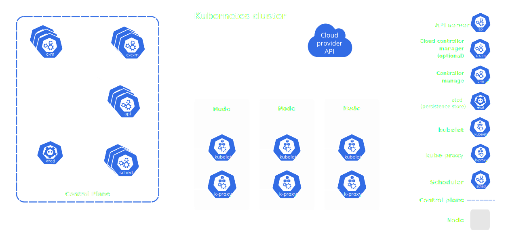

# ☀️ Jun 12, 2023
Tech : Kubernetes, CSS

# Kubernetes

## Kubernetes Architecture



### Kubernetes consists of 6 components

1. **kube-apiserver**
    
    Allows user interaction via `kubectl` or other tools.
     
2. **etcd**

    Key-Value Storage. Stores all Data Requires to manage a Kubernetes cluster.

3. **kubelet**

    Agent that runs on each node and is Responsible for Running Container as Expected.

4. **container runtime**

    Allow to run Containers.

5. **controller**

    Notices & Responds when endpoint does down.

6. **scheduler**

    Balances Load and Provision Resource to new Containers.

<hr>

## Control Plane vs Nodes

### Components of a Control Plane ( or Master Node)
- kube-apiserver
- etcd
- controller
- scheduler

### Components of a Node ( or Worker Node or Minion)
- kubelet
- container runtime

<hr>

## Install `minikube` and `kubectl`

minictl : [https://minikube.sigs.k8s.io/docs/start/](https://minikube.sigs.k8s.io/docs/start/)

kubectl : [https://kubernetes.io/docs/tasks/tools/](https://kubernetes.io/docs/tasks/tools/)

<hr>

## Starting First Cluster

``` bash
minikube start --driver=<driver>
```

List of driver = [https://minikube.sigs.k8s.io/docs/drivers/](https://minikube.sigs.k8s.io/docs/drivers/)

<hr>

## Deploy `hello-minikube`

### Reference : [https://kubernetes.io/docs/tutorials/hello-minikube](https://kubernetes.io/docs/tutorials/hello-minikube)

<hr>

# CSS

## Wrote CSS for [https://thekarananand.github.io/ToDo/](https://thekarananand.github.io/ToDo/)

