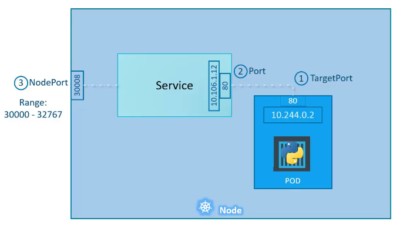

# ☀️ Jun 17, 2023
Tech : Kubernetes, JavaScript

# Kubernetes

## Basic of Kubernetes Networking

- Kubernetes Provision an Internal IP all the PODS (not containers).
- This Internal IPs in generally of `10.244.0.0` series.
- It's obvious that any NODE in a Cluster has its own IP.
- To make the Service from a PODS instance, by using a PORT on the cluster, we use `KUBERNETES SERVICE` object

## Kubernetes Services 

3 Types of Services :

1. NodePort
2. ClusterIP
3. LoadBalancer

## NodePort



### Basic `service.yml` file

``` YAML
apiVersion: v1
kind: Service
metadata:
    name: my-app-service
    label:
        someRandomLabel1: value1
        someRandomLabel2: value2

spec:
    type: NodePort
    ports:
     - targetPort: 80
       port: 80
       nodePort: 30080
    selector:
        label1: value1
        label2: value2
```
- `type` is to define the type of service
- `ports` is to define the ports for the service
    - `port` is mandatory.
    - If `targetPort` is not specified, `targetPort` = `port`
    - If `nodePort` is not specified, `nodePort` = any available port b/w 30000 and 32767
- `selector` to select the Pods for the service

### Getting Services 

``` bash
kubectl get svc
```

``` bash
kubectl service <NAME> --url
```

# JavaScript

## How to Iterate all the properties of an object?

### Way 1 : Using for-in loop

``` JS
let rectangle = {
    length: 2,
    break: 3
}

for (let key in rectangle) {
    console.log(key, rectangle[key])
}
```

**OUTPUT**
``` 
length 2
break 3
```
### Way 2 : Using for-of loop
``` JS
let rectangle = {
    length: 2,
    break: 3
}

for (let key of Object.entries(rectangle)) {
    console.log(key)
}
```

**OUTPUT**
```
[ 'length', 2 ]
[ 'break', 3 ]
```

## `in` Operator

Used to check if a property exists in an object

``` JS
console.log('length' in rectangle )
```
> Note this operator can't be used to check wether an element exists in array, for that we have : 
> ``` JS
> arr.includes(element)
> ```


## How to Clone Objects

Objects in JS of Reference Type, i.e., unlike Primitive types, we can't clone these using `let newObject = oldObject`, doing this will lead newObject to point to oldObject. 

3 ways :

### 1. Iteration
``` JS
let newObject1 = {}

for (let key in rectangle){
    newObject1[key] = rectangle[key] 
}
```

### 2. Assign
``` JS
let newObject2 = Object.assign({}, rectangle)
```

### 3. Spread
``` JS
let newObject3 = { ... rectangle}
```