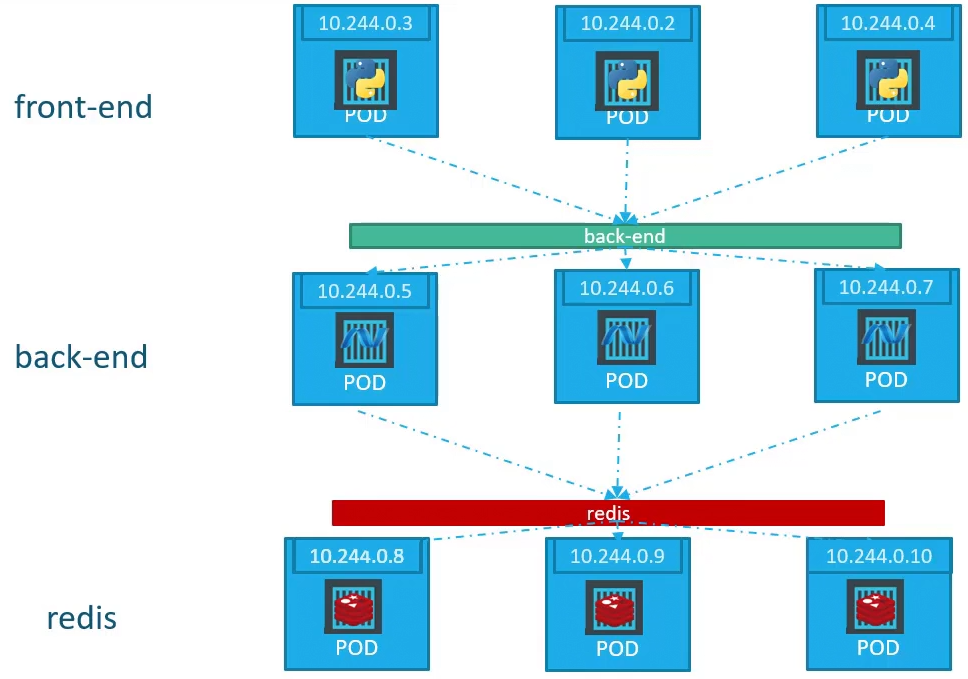
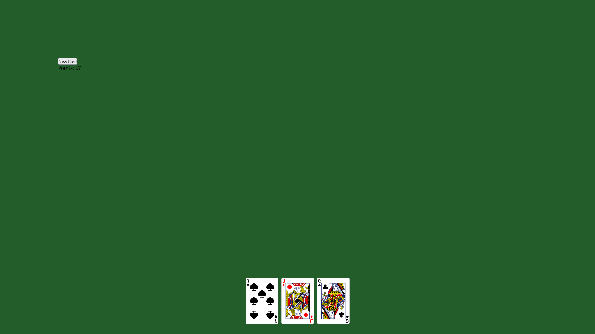

# ☀️ Jun 18, 2023
Tech : Kubernetes, WebDev

# Kubernetes

## Kubernetes Services 

## ClusterIP

Since, the IP assigned to Pods are not static, and Pods get destroyed & recreated, all the time, we can't rely on these IPs. To make the communication between the Pods possible, We use ClusterIP Service. This Service allows the communication to the selected Pods, by using service name.



### Basic `service.yml` file

``` YAML
apiVersion: v1
kind: Service
metadata:
    name: back-end
    label:
        someRandomLabel1: value1
        someRandomLabel2: value2

spec:
    type: ClusterIP
    ports:
     - targetPort: 80
       port: 80

    selector:
        label1: value1
        label2: value2
```

- `name: back-end` is used for the communication
- `type: ClusterIP` is to default.
- `ports` is to define the ports for the service
    - `targetPort` is the Port on the Pods.
    - `port` is on the Services.
- `selector` to select the Pods for the service

# WebDev

## Attempted to Build a BlackJack

