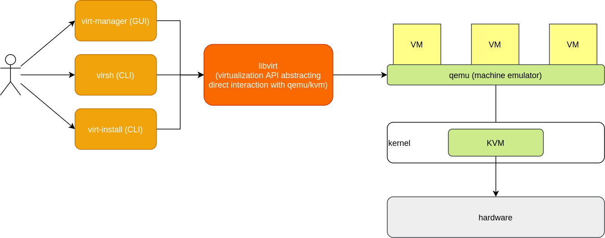

# ☀️ Jun 20, 2023
Tech : KVM, JavaScript 

# KVM - Kernel based Virtual Machine

## Dependencies to install
`qemu` , `dhclient` , `openbsd-netcat` , `virt-viewer` , `libvirt` , `dnsmasq` , `dmidecode` , `ebtables` , `virt-install` , `virt-manager` , `bridge-utils` ,

<hr>

## Basic Architecture


### kvm
- Kernel module that handles CPU and memory communication

### qemu = <u>Q</u>uick <u>EMU</u>lator
- Emulates hardware resources such as disk, network, and USB

### libvirt
- API for virtualization

### User-Client tools

- `virsh` = CLI tools for communicating with libvirt
- `virt-manager` = GUI to manage KVM
- `virt-install` = creating new VM
- `virt-viewer` = UI for interacting with VMs

<hr>

## start `libvirtd` daemon

``` bash
sudo systemctl start libvirtd
```

optionally, we can also put this service on startup with the following command

``` bash
sudo systemctl enable libvirtd
```

<hr>

## A lot of qemu session  :

1. `qemu:///system`
2. `qemu:///user`

and more.... 

These are created by default.

<hr>

## How to Start the default network

While setting up the VM, you may be prompted that your Default Network in not ON

``` bash
virsh net-start default
```

<hr>

## Now, we can create VMs with virt-manager

<hr>

### Listing VMs with `virsh` 

``` bash
virsh list [--all]
```

- `--all` flag is to show active & inactive VMs

<hr>

Most Probably, this command will show that VMs with `sudo`.

```
>>> virsh list --all

 Id   Name   State
--------------------
```
```
>>> sudo virsh list --all
[sudo] password:

 Id   Name    State
-----------------------
 1    win11   running
```

**Reason**: `virt-manager` by default create VMs in `qemu:///system`, whereas, `virsh` looks for VMs in user's session i.e., `qemu:///user`.

To fix this conflict, Either we have to use `sudo`, each time or we needs to set permission. Follow the following steps to adjust permissions:

1. Copy the `libvirt.conf` file.
    ```
    sudo cp -rv /etc/libvirt/libvirt.conf ~/.config/libvirt/
    ```

2. Know your user group.
    ```
    cat /etc/group | grep $USER
    ```

3. Edit `~/.config/libvirt/libvirt.conf` file.

    By Default

    ```
    ...
    # These can be used in cases when no URI is supplied by the application
    # (@uri_default also prevents probing of the hypervisor driver).
    #
    # uri_default = "qemu:///system"
    ```

    Uncomment the last line.

    ```
    ...
    # These can be used in cases when no URI is supplied by the application
    # (@uri_default also prevents probing of the hypervisor driver).
    #
    uri_default = "qemu:///system"
    ```

4. Change Permissions of `~/.config/libvirt/libvirt.conf` file.
    ```
    sudo chown $USER:<GROUP> ~/.config/libvirt/libvirt.conf
    ```

<hr>

# JavaScript

### Primitive String Creation
``` JS
let Name = "Karan"
console.log(typeof(Name))
```
will return
```
string
```

### Object String Creation
``` JS
let Name = new String("Karan")
console.log(typeof(Name))
```
will return
```
object
```

<hr>

### worked with String Methods from [MDN](https://developer.mozilla.org/en-US/docs/Web/JavaScript/Reference/Global_Objects/String#instance_methods)