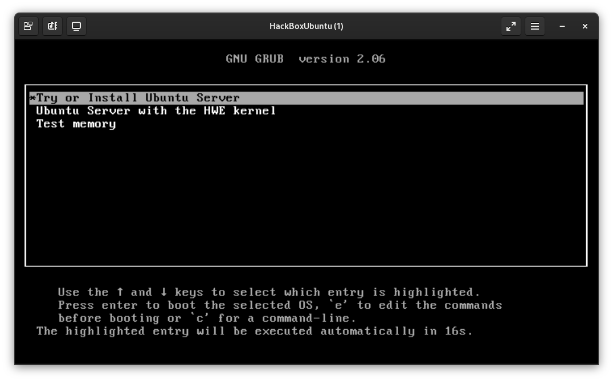

# ☀️ Jun 21, 2023
Tech : KVM, OpenSSH, React

# KVM

## Creating VMs via `virt-install` cli

``` bash
virt-install \
 --name <NAME> \
 --vcpus <CPU_CORES> \
 --ram <RAM> \
 --disk path=<DISK>,size=<SIZE> \
 --cdrom <PATH_TO_ISO>
```

- Default location for DISKS is `/var/lib/libvirt/images/` and have `.qcow2` extension.
- size of DISK is in GBs
- size of RAM is in MBs

<hr>

### Example:
``` bash
virt-install \
 --name HackBoxUbuntu \
 --vcpus 4 \
 --ram 4096 \
 --disk path=/var/lib/libvirt/images/HackBoxUbuntu.qcrow2,size=20 \
 --cdrom ~/Downloads/ubuntu-22.04.2-live-server-amd64.iso
```

and here's the new VM



<hr>

## Cloning VMs with `virt-clone` cli

```
virt-clone \
 --original <VM TO CLONE> \
 --name <NEW_VM_NAME> \
 --file <DISK_LOCATION>
```

- `--file` is to specify the location for new VM's Disk

<hr>

### Example:
``` bash
virt-clone \
 --original HackBoxUbuntu \
 --name HackBoxUbuntu2 \
 --file /var/lib/libvirt/images/HackBoxUbuntu2.qcrow2
```

<hr>

# Setting up OpenSH

## On the Target Machine 🖥️

### Step 1 : install `openssh-server` with the Package Manager


### Step 2 : Enable the ssh service 

``` bash
sudo systemctl enable ssh --now
```

### Step 3 : Start the ssh service 

``` bash
sudo systemctl start ssh
```

### Step 4 : Don't forget to check the IP 

``` bash
ip addr
```
## On Your Machine 👨‍💻

### login into the system using:

``` bash
ssh <userName>@<server-IP>
```

> **NOTE**: if you are facing following error
> ```
> ssh Host key for x.x.x.x has changed and you have requested strict checking.
> Host key verification failed.
> ```
> **Solution** : removing old key on HOST machine, remove `~/.ssh/known_hosts`

# React

## Creating a React App

``` Bash
npx create-react-app <NAME>
```

- `<NAME>` = Name of the project. Please keep it in small letters. This will create a directory with the same name

## RUN the WebApp

inside the project directory

``` Bash
npm start
```