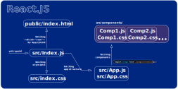
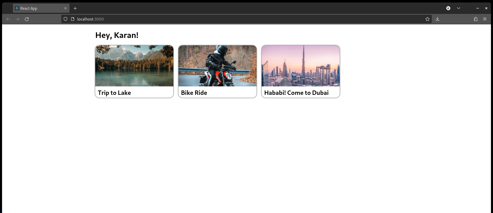
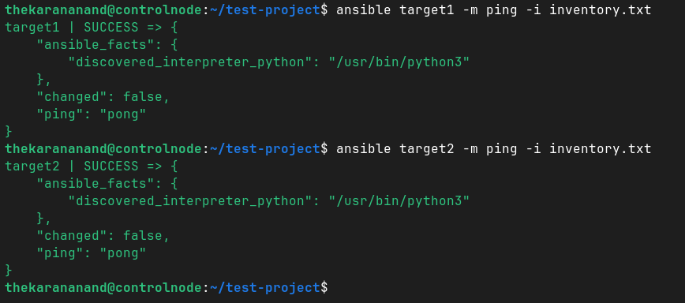

# ☀️ Jun 22, 2023
Tech : React, VM Networking, Ansible


# React

## Major Points of Interaction Points

- `package.json` = contains metadata, dependencies, scripts, etc.

- `src`
    - index.js
    - index.css
    - app.js
    - app.css

- `public`
    - index.js

## What's Going on?



## Build my First React WebApp

[Check The Code!](https://github.com/thekarananand/summer2023/blob/main/2023.06.22/firstapp) 



# KVM

### List Network

```
virsh net-list
```

### List Devices, IP Addresses & DHCP Lease for a Network 

```
virsh net-dhcp-leases <NETWORK>
```

# Ansible

## Setting Up Lab

- Created 3 VM running Ubuntu Server (with OpenSSH-Server), with name
    - `controlnode`
    - `target1`
    - `target2`

- from `controlnode` ssh-ed into `target1` and `target2` VMs

- Installed Ansible on `contolnode`

- created `inventory.txt`

    ```
    target1 ansible_host=192.168.24.10 ansible_ssh_pass=PassWord
    target2 ansible_host=192.168.24.20 ansible_ssh_pass=PassWord
    ```

- Running Ping Test

    