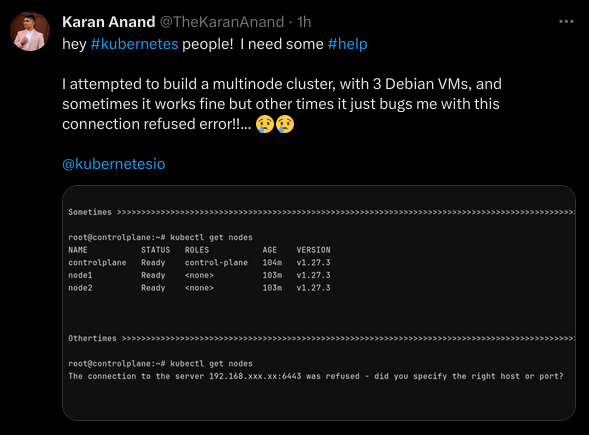

# ☀️ Jul 7, 2023

## How to Create a Multinode Kubernetes Cluster for HomeLab ?
(Unsuccessful Attempt)


1. Create VMs for Control-Plane & Nodes

    - with SSH Server
    - without swap
    - root user enabled

2. [All VMS] SSH as Normal user and switch to root user 

    ```
    su
    ```

3. [All VMS] Enable SSH as Root

    ```
    echo 'PermitRootLogin=yes'  | tee -a /etc/ssh/sshd_config
    sudo systemctl restart sshd
    ```

4. [All VMS] Turn off Swap

    ```
    swapoff -a
    ```

5. [All VMS] Install prerequisites

    ```
    apt install -y apt-transport-https curl gpg sudo
    ```

6. [All VMS] Install Docker

    ```
    apt install -y docker.io 
    ```

7. [All VMS] Add Google Cloud Repo

    ```
    curl -fsSL https://packages.cloud.google.com/apt/doc/apt-key.gpg | gpg --dearmor -o /etc/apt/keyrings/kubernetes-archive-keyring.gpg

    echo "deb [signed-by=/etc/apt/keyrings/kubernetes-archive-keyring.gpg] https://apt.kubernetes.io/ kubernetes-xenial main" | tee /etc/apt/sources.list.d/kubernetes.list
    ```

8. [All VMS] apt update

    ```
    apt update
    ```

9. [All VMS] Install Kubernetes Components

    ```
    apt install -y kubelet kubeadm kubectl
    ```

10. [Control Plane] Initialize the cluster

    ```
    kubeadm init
    ```

    This Command will return a kubeadm command, run those command on Nodes, to make them Join the Cluster

11. [Control Plane] Add the Config Files

    ```
    mkdir -p $HOME/.kube
    cp -i /etc/kubernetes/admin.conf $HOME/.kube/config
    chown $(id -u):$(id -g) $HOME/.kube/config
    ```

12. [Control Plane] run `kubectl get nodes`

    ```
    root@controlplane:~# kubectl get nodes
    NAME           STATUS      ROLES           AGE    VERSION
    controlplane   NotReady    control-plane   104m   v1.27.3
    node1          NotReady    <none>          103m   v1.27.3
    node2          NotReady    <none>          103m   v1.27.3
    ```

    may take a while or a Reboot

13. Deploy
    [Calico](https://docs.tigera.io/calico/latest/getting-started/kubernetes/self-managed-onprem/onpremises#install-calico-with-kubernetes-api-datastore-50-nodes-or-less)
    for Cluster Networking

<hr>

And Here, we are



<hr>

# wikiNetes

1. Added a Footer to display container ID

2. Build a Docker Image of WikiNetes. Check it on [Docker Hub](https://hub.docker.com/r/thekarananand/wikinetes)