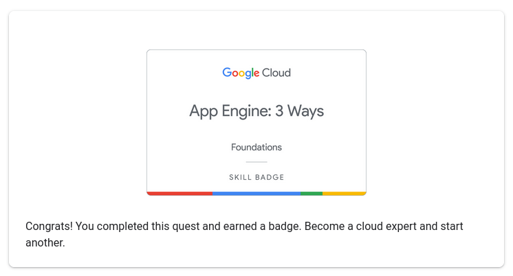

# ☀️ Jul 14, 2023

## Basics of GCP

List the Active Account Name

``` bash
gcloud auth list
```

List the Project ID

``` bash
gcloud config list project
```


Set the Region for the project

``` bash
gcloud config set compute/region <REGION>
```

## Google App Engine

App Engine is a fully managed, serverless platform for developing and hosting web applications at scale

### Deploy App to App Engine

run the following command from within the root directory of your application where the app.yaml file is located

```
gcloud app deploy
```

### View Deployment

```
gcloud app browse
```

## Completed App Engine Foundational Path


